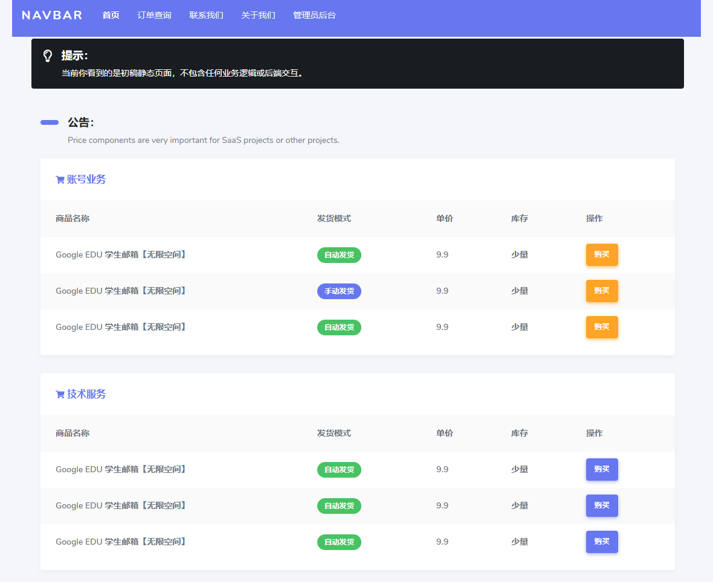

<p align="center">
  <a href="https://baiyue.one/">
    
  </a>
</p>

<h1 align="center">佰阅发卡</h1>

<p align="center">
  基于VUE3.0+FLASK构建的全新卡密发卡系统
    <br>
  <br>
  <a href="https://jq.qq.com/?_wv=1027&k=1NdPevjF">反馈 bug</a>
  ·
  <a href="https://jq.qq.com/?_wv=1027&k=1NdPevjF">提交 功能</a>
  ·
  <a href="https://baiyue.one/">Blog</a>
</p>


## 预览地址：0.2版

最新版预览地址： http://107.148.243.178:8000
内测BUG反馈QQ群：853791822

## 部署方法：

一键部署：
```bash
docker run --name kmfaka -itd --restart=always -p 8000:8000 baiyuetribe/kamifaka:0.2
#如果提示docker命令未找找，请先安装好Docker后再来执行上面的脚本。
# Docker环境安装脚本[如果上述脚本正常，下面的脚本可忽略不运行]
echo y | bash <(curl -L -s https://raw.githubusercontent.com/Baiyuetribe/codes/master/docker.sh)
```
然后访问http://您的ip:8000即可访问，管理员加上/admin即可访问，默认管理员：admin@qq.com 密码：123456

卸载命令：
```bash
docker rm -f kmfaka && docker rmi -f baiyuetribe/kamifaka:0.2
```


已完成数据库设计、后端api和前端UI设计，正在完成前后端对接和前端的相关业务逻辑。
访客页面：

管理员界面：


## 内测说明
经过多轮优化，内测0.2版本已发布，相对原先的nginx+flask多镜像有了很大的部署便捷性。修复移动端UI、管理员登录异常等bug.

功能概述:当前内测版已完成发卡系统的主要运行逻辑，前端的下单流程、后端的分类、商品、卡密、邮箱、通知信息等都非常完善。短信通知暂不可用外，其余都正常工作。

## 当前开发计划：
收集BUG反馈=》发布第一个正式版

当前任务：征集内测bug


## 已完成功能：
访客界面：
- 商品展示首页
- 商品细节展示
- 订单查询
- 订单支付流程


管理员界面：
- 分类设置（增删改查）
- 商品设置（增删改查）
- 卡密设置（增删改查）
- 订单列表（查、删）
- 支付设置（核心模块）
- 消息通知
- 账户修改
- 邮箱设置

### 项目依赖
前端UI：Stisla --> https://github.com/stisla/stisla
前端交互程序：vue3.0 --> https://github.com/vuejs/vue-next
后端：Flask --> https://github.com/pallets/flask
管理员接口：Flask-JWT --> https://flask-jwt-extended.readthedocs.io/en/stable/

## 如何参与该开源项目？

我们欢迎任何人参进来，不论前端UI美化、细节讲究，还是代码BUG、功能异常等情况，都可以积极反馈。

## License

MIT